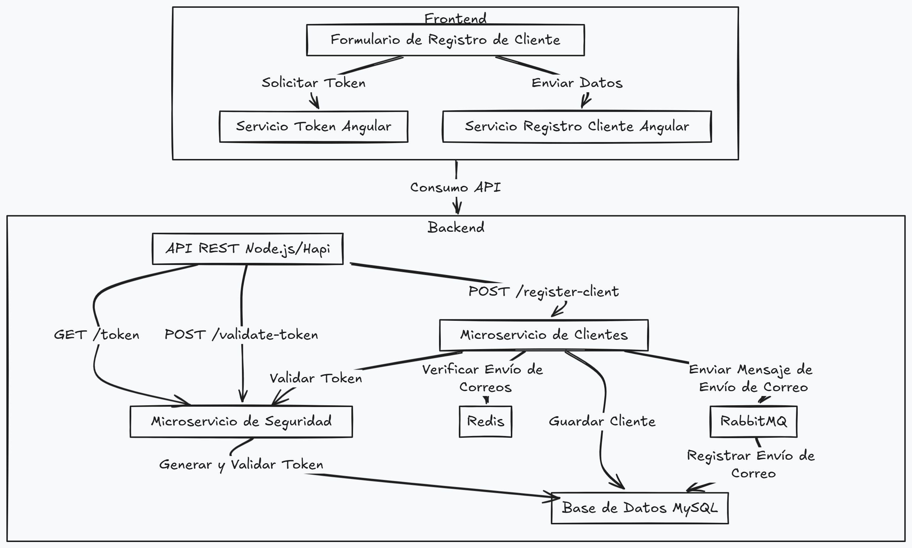

# Proyecto de Registro de Clientes - Backend

Este proyecto es una aplicación para el registro de clientes siguiendo una arquitectura de microservicios. Está desarrollado en **Node.js** con **Hapi** como framework para el backend. Utiliza **Redis** para el almacenamiento de parámetros y **RabbitMQ** para la comunicación entre servicios. La base de datos utilizada es **MySQL**.

## Descripción del Proyecto

El proyecto permite el registro de clientes, donde el usuario ingresa su información y, tras la validación del token de seguridad, se guarda en la base de datos. Un microservicio de seguridad se encarga de generar y validar un token, mientras que el microservicio de clientes valida los datos y decide si enviar un correo de bienvenida.

## Diagrama de Arquitectura



## Requisitos para Ejecutar el Proyecto

- **Node.js**: v14 o superior.
- **Docker** y **Docker Compose**.
- **Redis** y **RabbitMQ** (estos servicios se ejecutan en contenedores Docker).

## Instalación y Configuración

### Paso 1: Clonar el Repositorio

```bash
# Clonar el repositorio de GitHub
git clone https://github.com/christian-tong/PruebaTecnica-IAInfinite-Backend.git
cd PruebaTecnica-IAInfinite-Backend
```

### Paso 2: Configurar el Backend

1. **Instalar dependencias**:
   ```bash
   npm install
   ```
   
### Paso 3: Ejecutar Servicios con Docker

Para ejecutar Redis y RabbitMQ mediante Docker, utiliza el siguiente archivo `docker-compose.yml`:

```yaml
version: '3.8'
services:
  redis-server:
    image: redis
    container_name: redis-server
    ports:
      - "6379:6379"

  rabbitmq-server:
    image: rabbitmq:3-management
    container_name: rabbitmq-server
    ports:
      - "15672:15672" # Interfaz de gestión de RabbitMQ
      - "5672:5672"   # Puerto para la comunicación entre servicios
```

Ejecuta el siguiente comando para iniciar los servicios:

```bash
docker-compose up -d
```

### Paso 4: Ejecutar el Backend

1. **Iniciar el servidor**:
   ```bash
   node .\src\server.js
   ```

El backend estará disponible en `http://localhost:3000`.

## Comandos Útiles de Docker

- **Ver contenedores activos**:
  ```bash
  docker ps
  ```
- **Detener todos los contenedores**:
  ```bash
  docker-compose down
  ```
- **Ver logs de RabbitMQ**:
  ```bash
  docker logs rabbitmq-server
  ```

## Proceso de Registro

1. El cliente solicita un token al microservicio de seguridad (GET `/token`).
2. El token se valida cuando el cliente envía sus datos (POST `/validate-token`).
3. Tras validar el token, se registra al cliente en la base de datos.
4. Si la configuración lo permite, se envía una solicitud a RabbitMQ para registrar un correo de bienvenida.

## Contribuciones

Las contribuciones son bienvenidas. Por favor, abre un issue primero para discutir los cambios que deseas realizar.

## Licencia

Este proyecto está bajo la licencia MIT. Consulta el archivo LICENSE para más detalles.
